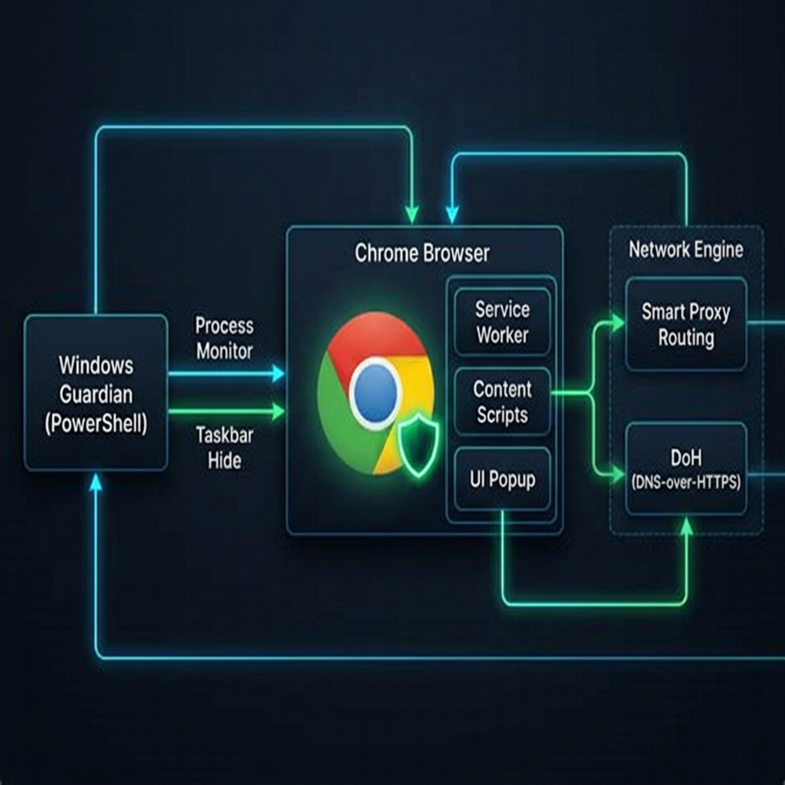

# 🛡️ SecureInvisible



**SecureInvisible** is a powerful, multi-layered Chrome extension and Windows guardian system designed to provide ultimate browser persistence, anti-detection, and network bypassing. 

Whether you need to ensure your browser remains open during important tasks, hide your browser's footprint from tracking scripts, or bypass restrictive networks to access AI tools like ChatGPT and Claude, SecureInvisible has you covered.

---

## ✨ Key Features

### 1. 🔒 Unclosable Protection
- **Shortcut Blocking:** Completely blocks `Ctrl+W`, `Ctrl+Shift+W`, `Ctrl+Q`, and `Alt+F4` so tabs and windows cannot be accidentally or intentionally closed via the keyboard.
- **Auto-Reopen Engine:** If a window is somehow closed, the extension instantly reopens it, restoring all your active tabs exactly as they were.
- **Process Guardian:** The companion Windows script ensures that if the Chrome process is killed via Task Manager or other software, it restarts within 2 seconds.

### 2. 👻 Stealth & Anti-Detection
- **Taskbar Invisibility:** The Guardian script removes Chrome's icon from the Windows taskbar, making it visually invisible to anyone looking at your desktop.
- **Fingerprint Spoofing:** Injects noise into Canvas and WebGL APIs to prevent advanced tracking scripts from fingerprinting your browser.
- **Automation Hiding:** Removes the `navigator.webdriver` flag and other traces that websites use to detect automated or modified browsers.

### 3. 🌐 Smart Network Bypass
- **DNS-over-HTTPS (DoH):** Bypasses local DNS blocking by resolving domains directly through encrypted channels (Cloudflare, Google, or Quad9).
- **Smart Proxy Routing:** Configure a proxy (HTTP/HTTPS/SOCKS5) in the popup. SecureInvisible intelligently routes *only* blocked traffic through the proxy, ensuring fast speeds for normal browsing.
- **Automatic Block Detection:** Instantly detects when a network (school, work, ISP) blocks a site and presents a custom Bypass Dashboard with 1-click alternatives (Google Cache, Web Archive, Google Translate Proxy).

---

## 🚀 How to Install & Add to Chrome

Follow these steps to install SecureInvisible into your Chrome browser:

### Step 1: Prepare the Files
1. Download or locate the `SecureInvisible-Production.zip` file.
2. Extract the ZIP file into a folder on your computer (e.g., `C:\SecureInvisible`).

### Step 2: Load into Chrome
1. Open Google Chrome.
2. Click the three dots (Menu) in the top right corner → **Extensions** → **Manage Extensions**.
   *(Alternatively, type `chrome://extensions/` in your address bar and press Enter).*
3. In the top right corner of the Extensions page, turn **ON** the **Developer mode** toggle switch.
4. Click the **"Load unpacked"** button that appears in the top left.
5. Select the folder where you extracted the extension (or select the `dist` folder if you built it from source).
6. SecureInvisible is now installed! You will see the green shield icon in your extension bar.

### Step 3: Activate the Guardian (Windows Only)
To enable the ultimate protection (Taskbar hiding & auto-restart):
1. Open the folder containing the extension source code.
2. Double-click the **`START_GUARD.bat`** file. 
3. A console window will briefly appear and then hide itself. Your browser is now fully shielded at the OS level!
4. To stop the Guardian and return Chrome to normal, double-click **`STOP_GUARD.bat`**.

---

## ⚙️ Configuration & Usage

Click on the **SecureInvisible** icon in your Chrome toolbar to open the control panel:

- **Main Shield Toggle:** Turn the core protections (auto-reopen, stealth mode) ON or OFF.
- **Bypass Blocks Toggle:** Turn this ON to activate the network bypass engine.
- **Network Bypass Settings:** Expand this menu to select your DoH provider (Cloudflare is recommended) or enter your Proxy details.
- **Stats Dashboard:** View real-time statistics on how many close attempts have been blocked and your current protection uptime.

---

## 🛠️ For Developers (Building from Source)

If you are modifying the source code and want to generate a new production build:

1. Ensure you have [Node.js](https://nodejs.org/) installed.
2. Open a terminal in the project folder and run:
   ```bash
   npm install
   npm run build
   ```
3. This will minify the code, strip console logs, and generate a fresh `SecureInvisible-Production.zip` and a `dist/` folder ready for Chrome.

---

*Disclaimer: The Guardian script uses Windows API calls to hide Chrome from the taskbar. Chrome will still be visible in the Windows Task Manager. This tool is designed for personal productivity, privacy, and accessibility.*
